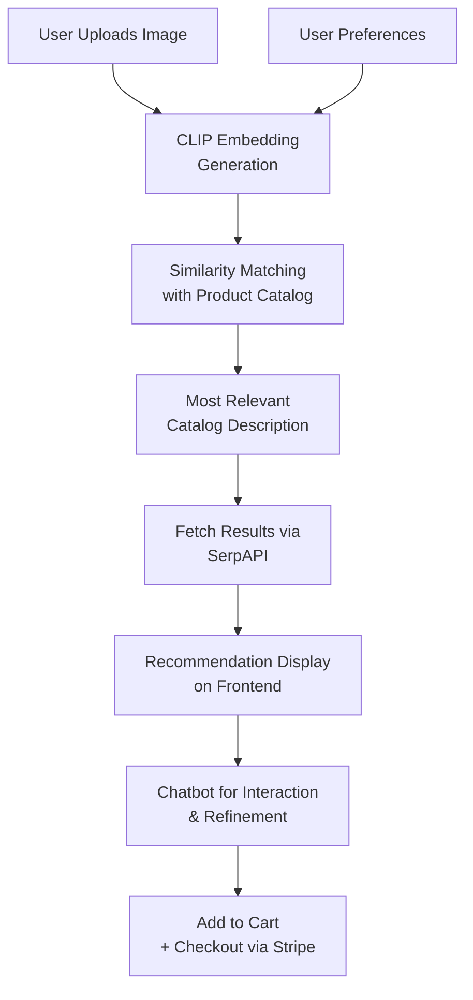

# 🛍️ StyleFinder: AI-Powered Personal Shopping Assistant

**Finale Submission - IIT-M AI Hackathon 2025**  
**Theme**: *AI-Powered E-Commerce*

---

## 🚀 Overview

**StyleFinder** is a multimodal AI-based shopping assistant designed to elevate the e-commerce experience. Users can upload an image of any product or style they like, and the assistant will intelligently recommend similar and complementary products by analyzing the image, catalog data, and user preferences.

---

## 🔧 Key Features

- 📸 **Image-Based Input**  
  Upload an image to discover similar or complementary items.

- 🧠 **Visual Understanding with CLIP**  
  Converts the uploaded image into an embedding and combines it with user preferences to find the closest matching description in the catalog.

- 🔍 **Smart Recommendations via SerpAPI**  
  The inferred product description is sent to SerpAPI to retrieve real-world, relevant product results.
- 🛒 **Add to Cart**
  Users can add one or more recommended items to a shopping cart.
  
- 💳 **Checkout with Stripe**
  Seamless checkout process simulated or enabled via Stripe's API.

- 🤖 **Integrated Chatbot**  
  A chatbot helps users interactively refine their searches and understand the results.

- 🎨 **Preference-Aware Personalization**  
  User preferences (from a dedicated tab) are embedded into the recommendation pipeline for better accuracy.

---

## 🧱 System Architecture



---

## 🤖 AI & Tools Used

| Component              | Tool/Model Used             |
|-----------------------|-----------------------------|
| Vision Embedding      | OpenAI CLIP                 |
| Preferences Integration | Vector-weighted relevance   |
| Description Search    | Similarity search on catalog |
| Web Search API        | SerpAPI                     |
| Chatbot               | GPT API  |
| Backend               | Flask (Python)              |
| Frontend              | React.js                    |
| Data Storage          | JSON (catalog), Numpy       |
| Checkout              | Stripe                      |
---

## ⚙️ Setup Instructions
# 🔧 Quick Start: How to Use This Codebase
# 🚀 Clone the Repository

```bash
git clone https://github.com/bharatnageshr/fashion_assistant.git
cd shop-smarter
export SERP_API_KEY=your_serpapi_key
export STRIPE_SECRET_KEY=your_stripe_key

# On Windows, use:
set SERP_API_KEY=your_serpapi_key
set STRIPE_SECRET_KEY=your_stripe_key
```

---

## 📦 Install Dependencies

**Ensure you have Python 3.8+ and Node.js installed.**

### Backend:
```bash
cd backend
python3 -m venv venv
source venv/bin/activate    # On Windows: venv\Scripts\activate
pip install -r requirements.txt
```

### Frontend:
```bash
cd ../frontend
npm install
```

---

## ▶️ Run the Application

### Backend:
```bash
cd backend
python app.py
```

### Frontend:
```bash
cd ../frontend
npm start
```

---

## 💡 How It Works

1. **Upload** an image from the homepage.
2. The **backend** computes a **CLIP embedding** for the image and combines it with user preferences.
3. The system finds the **most similar item** in the catalog using cosine similarity.
4. The **catalog description** of that item is sent to **SerpAPI**, which returns real-world product matches.
5. A **chatbot** allows users to ask for further suggestions, clarifications, or refinements.
6. The **frontend displays** the results in a clean, intuitive UI.
7. Fetches **similar** and **complementary** products.
8. The user can add items to the **cart**.
9. **Stripe** checkout handles the payment flow.


---

## 🧪 Example Use Cases

- 👗 Upload a dress photo → Get similar dresses and fashion accessories.
- 🏠 Upload living room image → Get lamps, pillows, and matching decor.
- 👟 Upload sneakers → See alternatives and matching athletic gear.
- 💬 Ask chatbot: “Show cheaper alternatives” or “Match this with socks.”

---

# 🗂️ Project Structure

```
backend/
 └── app.py
     └── recommender/
         └── data/
             ├── catalog.json
             ├── embeddings.npy
             ├── model_utils.py
             └── build_catalog.py
frontend/
 └── src/
     └── public/
         └── App.js, Preferences.js, Chatbot.js
README.md
```

---

## ✨ Highlights

- ✅ **Multimodal AI system** (image + preferences)
- ✅ **Live product discovery** with SerpAPI
- ✅ **Chatbot integration** for query handling
- ✅ **Frontend/Backend separation** with easy setup
- ✅ **Complementary products and Personalized products at**

---

## 👥 Team

- Reddi Srujan
- Bharat Nagesh

---
---
