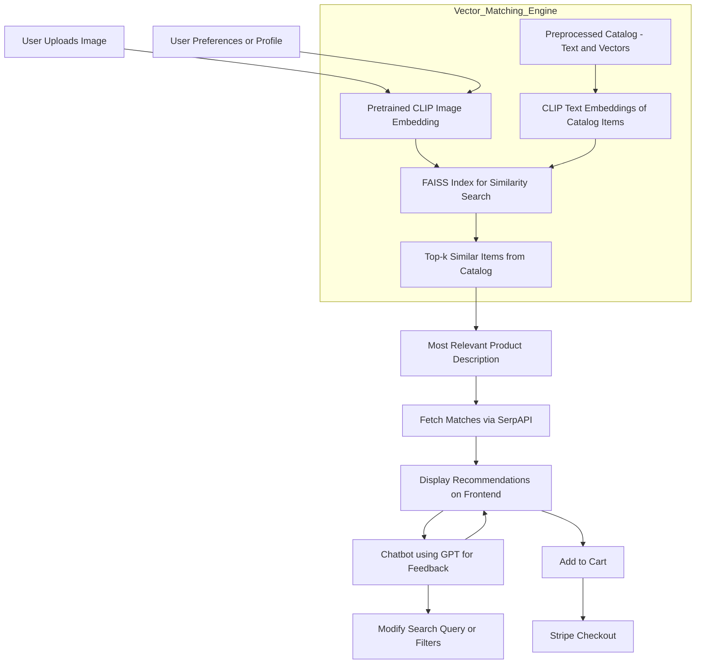

# 🛍️ StyleFinder: AI-Powered Personal Shopping Assistant

**Finale Submission - IIT-M AI Hackathon 2025**  
**Theme**: *AI-Powered E-Commerce*

---

## 🚀 Overview

**StyleFinder** is not just another shopping tool — it’s a *revolution* in how users discover fashion. Powered by cutting-edge AI, StyleFinder transforms your image inspiration into personalized shopping experiences. Whether you have a fashion photo or a vibe in mind, StyleFinder brings the perfect products to your fingertips with real-time search, visual AI, and natural interaction.

> 🧠 Multimodal, preference-aware, and chat-driven — *the ultimate AI shopping companion.*

---

## 🔧 Key Features

- 📸 **Image-Based Product Discovery**  
  Upload an image and instantly get similar or complementary fashion items.

- 🧠 **Visual Intelligence via CLIP**  
  Uses OpenAI's CLIP to extract visual semantics and match it with product catalogs.

- 🔍 **Real-Time Web Search with SerpAPI**  
  Converts embeddings to product descriptions and fetches actual e-commerce items.

- 💬 **Smart Chatbot Interface**  
  GPT-powered chatbot refines results, answers queries, and enhances interactivity.

- 🛒 **Cart Integration**  
  Add items you love directly to the cart — seamless and intuitive.

- 💳 **Secure Checkout with Stripe**  
  Real or simulated payments through Stripe APIs.

- 🎨 **Personalization Tab**  
  Feed your preferences and get tailor-made recommendations.

---

## 🧱 System Architecture


---

## 🤖 AI & Tools Used

| Component              | Tool/Model Used             |
|-----------------------|-----------------------------|
| Vision Embedding      | OpenAI CLIP                 |
| Preferences Integration | Vector-weighted relevance   |
| Description Search    | Cosine similarity            |
| Web Search API        | SerpAPI                     |
| Chatbot               | GPT API                     |
| Backend               | Flask (Python)              |
| Frontend              | React.js                    |
| Data Storage          | JSON, Numpy                 |
| Checkout              | Stripe                      |

---

## ⚙️ Setup Instructions

### 🔧 Quick Start

Clone and configure the repository:
```bash
git clone https://github.com/bharatnageshr/fashion_assistant.git
cd fashion_assistant

# Set environment variables
export SERP_API_KEY=your_serpapi_key
export STRIPE_SECRET_KEY=your_stripe_key

# On Windows:
set SERP_API_KEY=your_serpapi_key
set STRIPE_SECRET_KEY=your_stripe_key
```

---

## 📦 Install Dependencies

**Prerequisites:** Python 3.8+, Node.js, pip, npm

### 🔙 Backend:
```bash
cd backend
python3 -m venv venv
source venv/bin/activate    # On Windows: venv\Scripts\activate
pip install -r requirements.txt
```

### 💻 Frontend:
> 💡 Make sure you have Node.js (v16+) and npm installed.
```bash
cd ../frontend
npm install
```

---

## ▶️ Run the Application

### Backend:
```bash
cd backend
python app.py
```

### Frontend:
```bash
cd ../frontend
npm start
```

> ⚠️ App runs on `http://localhost:3000` (frontend) and `http://localhost:5000` (backend).

---

## 💡 How It Works

1. **Upload** an image on the homepage.
2. Backend generates a **CLIP embedding** and considers **user preferences**.
3. Uses **cosine similarity** to find closest matches in our catalog.
4. Extracted **description** is passed to **SerpAPI** for real-world results.
5. The frontend displays the results and lets users interact with a **chatbot**.
6. Products can be **added to cart**.
7. Payments are handled via **Stripe Checkout**.

---

## 🧪 Example Use Cases

- 👗 Upload a photo of a dress → Get similar dresses + accessories.
- 🛋️ Upload a living room photo → Get matching decor suggestions.
- 👟 Upload sneaker image → Discover alternatives + gym accessories.
- 💬 Ask chatbot: “Show cheaper alternatives” or “Match this with jeans.”

---

## 🗂️ Project Structure
```
backend/
 ├── app.py
 └── recommender/
     ├── data/
     │   ├── catalog.json
     │   ├── embeddings.npy
     │   ├── faiss_index.index
     │   └── build_catalog.py
     └── model_utils.py

frontend/
 └── src/
     ├── components/
     │   ├── App.js
     │   ├── Preferences.js
     │   └── Chatbot.js
     └── public/

README.md
```

---

## ✨ Highlights

- ✅ *Multimodal intelligence* (image + preferences)
- ✅ *Search + recommendation* fusion
- ✅ *AI-powered chat refinement*
- ✅ *End-to-end product interaction*: Upload → Recommend → Cart → Checkout
- ✅ *Fast, responsive frontend and scalable backend*

---

## 👥 Team

- **Reddi Srujan**  
- **Bharat Nagesh**

> Built with 💖 at IIT-M AI Hackathon 2025

